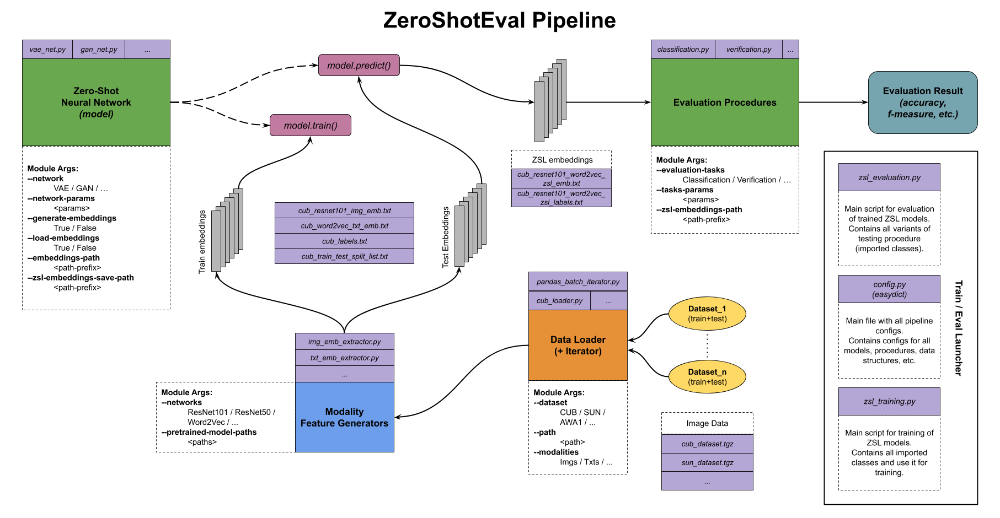

ZeroShotEval
===============

A Python toolkit for evaluating the quality of classification models for tasks of Zero-Shot Learning (ZSL) including the models construction with different insides (e.g. miscellaneous NN architectures), procedure for training and saving models for further evaluation.

Pipeline
---------

*NOTE: in the figure above there are examples of Python scripts and its names. Please note that it is work names for visualizing the structure of the project.*

Usage
---------

**Step 1: datasets loading**

Go to **scripts** directory and run downloading scripts. Example:

    cd ./scripts 
    ./cub_download.sh
    
All datasets are placed in **data** directory