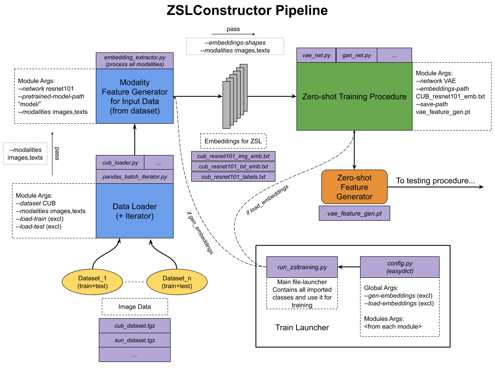

ZSLConstructor
===============

A Python toolkit for building classification models for Zero-Shot Learning tasks with different insides (e.g. miscellaneous NN architectures). Includes procedure for training and saving models for further evaluation.

Pipeline
---------

*NOTE: in the figure above there are examples of Python scripts and its names, please note that it is work names for visualizing the structure of the project.*